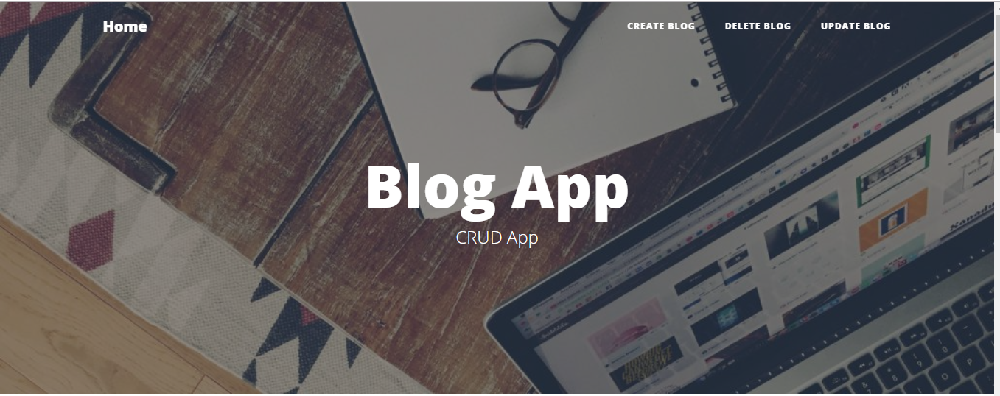

# Flask_RESTful

A basic flask project.
CRUD operations.
Model Blog:
  title
  content
  img_name
  image

Images are passed through sightengine api to check nudity score of image.
URL: https://flask-blog2.herokuapp.com/

 

<h1>Landing Page:</h1>

<h1>Blogs View:</h1>

